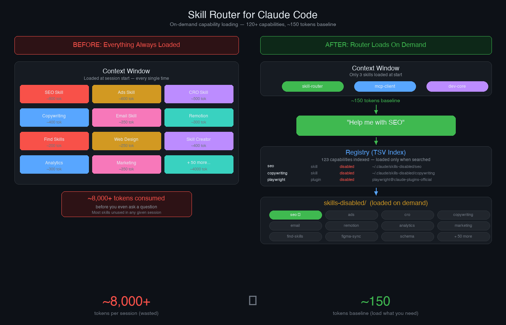

# Skill Router for Claude Code

On-demand capability loading for [Claude Code](https://docs.anthropic.com/en/docs/claude-code). Keep 100+ skills, commands, agents, and plugins installed without paying the token cost — the router loads only what you need, when you need it.

> **Note:** This is built specifically for Claude Code (Anthropic's CLI/Desktop app). It uses Claude Code's skill system, commands, plugins, and MCP integrations. It does not work with ChatGPT, Cursor, or other AI tools.



## The Problem

Every enabled skill in Claude Code loads its full description into every session's context window. With 10+ skills, that's thousands of tokens consumed before you even ask a question. But disabling skills makes them invisible — Claude won't know they exist.

## The Solution

The skill-router sits in every session (~150 tokens) and knows about everything you have installed. When you ask for something specialized, it:

1. Searches a lightweight TSV registry of all your capabilities
2. Finds the best match
3. Reads the matched skill's instructions and follows them on the fly

Disabled skills work as if they were enabled. Zero cost until invoked.

## What It Routes

| Type | How It Activates |
|------|-----------------|
| Disabled skill | Reads its SKILL.md, follows instructions directly |
| Enabled skill | Invokes via Skill tool normally |
| Disabled command | Reads its .md file, follows instructions |
| Enabled command | Reads its .md file, follows instructions |
| Disabled plugin | Tells you to enable it (can't hot-load MCP tools) |
| Enabled plugin | Uses tools directly |
| Disabled agent | Reads config, spawns agent |
| Superpowers sub-skill | Invokes via Skill tool |

## Install

```bash
git clone https://github.com/YOUR_USERNAME/skill-router.git
cd skill-router
bash install.sh
```

The install script will:
- Copy the skill-router to `~/.claude/skills/skill-router/`
- Scan your installed capabilities and generate the registry
- Add a routing instruction to your `~/.claude/CLAUDE.md`

Then restart Claude Code.

## Setup

After installing, move rarely-used skills to the disabled folder:

```bash
# Example: move a skill you don't use every session
mv ~/.claude/skills/some-skill ~/.claude/skills-disabled/some-skill

# Rebuild the registry to pick up the change
bash ~/.claude/skills/skill-router/scripts/rebuild-registry.sh
```

**Keep enabled** (always loaded):
- `skill-router` — the router itself
- `mcp-client` — if you use MCP servers
- `dev-core` — if you use it for development orchestration
- Any skill you use in nearly every session

**Move to disabled** (loaded on demand):
- Everything else

## Usage

Just talk naturally. The router triggers automatically when your request matches a specialized domain.

```
"Help me with SEO"              → loads seo skill
"Write copy for my landing page" → loads copywriting skill
"Create a Remotion video"        → loads remotion skill
"What can you do?"               → shows all categories
"Audit my Google Ads"            → loads ads-google skill
```

## Rebuild the Registry

After adding, removing, or moving skills:

```bash
bash ~/.claude/skills/skill-router/scripts/rebuild-registry.sh
```

The script scans:
- `~/.claude/skills/` (enabled skills)
- `~/.claude/skills-disabled/` (disabled skills)
- `~/.claude/commands/` (enabled commands)
- `~/.claude/commands-disabled/` (disabled commands)
- `~/.claude/agents-disabled/` (disabled agents)
- `~/.claude/settings.json` (plugins)
- Superpowers sub-skills (hardcoded list)

## How It Works

```
~/.claude/skills/skill-router/
├── SKILL.md                        # Router logic + activation protocol
├── scripts/
│   └── rebuild-registry.sh         # Generates the registry
└── references/
    └── registry.tsv                # Generated index (not committed)
```

The registry is a tab-separated file with one row per capability:

```
NAME    TYPE    CATEGORY    STATUS    PATH    KEYWORDS    DESCRIPTION
seo     skill   seo         disabled  ~/.claude/skills-disabled/seo    seo,audit,schema    Full SEO analysis
```

## Requirements

- [Claude Code](https://docs.anthropic.com/en/docs/claude-code) CLI or Desktop app
- Bash (macOS/Linux)
- Python 3 (for plugin detection from settings.json)

## License

MIT
